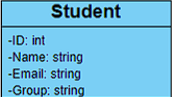
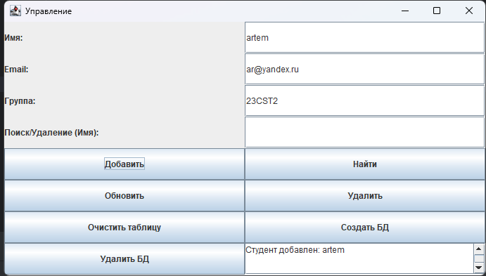
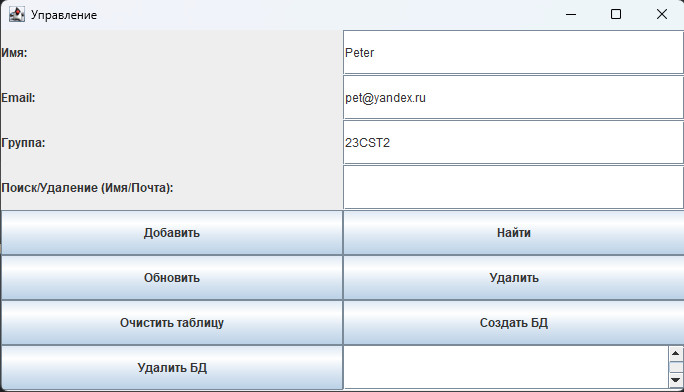

# Лабораторная работа №5 
Данная программа способна без использования консоли или pgAdmin4 проводить следующие операции:
- Создание однотабличной базы данных (важно(!) постарайтесь реализовать именно create database, а не только create table)
- Удаление базы данных
- Очистка таблицы
- Добавление новых данных
- Поиск по заранее выбранному (одному) текстовому не ключевому полю (эл. почта)
- Обновление базы данных
- Удаление по заранее выбранному (одному) текстовому не ключевому полю

База данных состоит из одной таблицы, взятой из лабораторной работы №1:

### Интерфейс взаимодействия:

Результат всегда выводится в нижнем правом окошечке.

### Запуск

Для запуска программы необходимо запустить файл StudentGUI.java

### Структура:
1. StudentGUI.java 

Файл хранит методы GUI для удобного взаимодействия с базой данных и её функционалом

2. StudentManager.java

Файл хранит в себе все функции по взаимодействию с базой данных, а также исходники скриптов функций PostgreSQL для удобной работы не заходя в pgAdmin4 или консоль. Это позволяет
удобно управлять БД и всем её функционалом не от ходя от окошка с GUI.