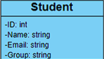
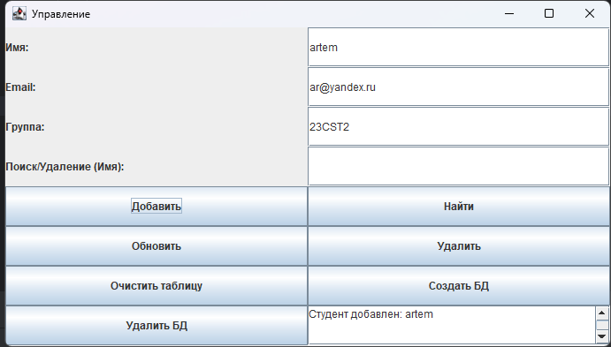
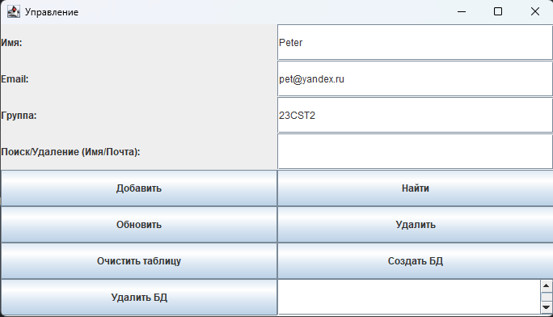

# JAVA_JBDC #

### Описание проекта
**JAVA_JBDC** — это приложение на Java, использующее JDBC для взаимодействия с базой данных PostgreSQL. Оно позволяет выполнять основные операции CRUD (создание, чтение, обновление, удаление) с данными, связанными с LMS (Learning Management System).

### Функциональность:
- Создание однотабличной базы данных
- Удаление базы данных
- Очистка таблицы
- Добавление новых данных
- Поиск по заранее выбранному (одному) текстовому не ключевому полю (эл. почта)
- Обновление базы данных
- Удаление по заранее выбранному (одному) текстовому не ключевому полю
- Использование хранимых процедур PostgreSQL для выполнения операций
- Графический интерфейс для удобного взаимодействия

### Технологии
- **Язык программирования**: Java
- **База данных**: PostgreSQL
- **API для работы с БД**: JDBC
- **GUI**: Swing
- **Управление зависимостями**: Maven

База данных состоит из одной таблицы, взятой из лабораторной работы №1:



### Интерфейс взаимодействия:





Результат всегда выводится в нижнем правом окошечке.

### Клонирование репозитория
```
git clone https://github.com/Artemiadze/JAVA_JBDC.git
cd JAVA_JBDC
```

### Запуск приложения
```
java StudentGUI.java
java StudentGUI
```

### Структура:
1. StudentGUI.java 

Файл хранит методы GUI для удобного взаимодействия с базой данных и её функционалом

2. StudentManager.java

Файл хранит в себе все функции по взаимодействию с базой данных, а также исходники скриптов функций PostgreSQL для удобной работы не заходя в pgAdmin4 или консоль. Это позволяет
удобно управлять БД и всем её функционалом не от ходя от окошка с GUI.

### Вклад в проект
Если хотите внести свой вклад:
1. Сделайте fork репозитория.
2. Создайте новую ветку (git checkout -b feature-branch).
3. Внесите изменения и закоммитьте (git commit -m 'Add new feature').
4. Отправьте изменения (git push origin feature-branch).
5. Создайте pull request.